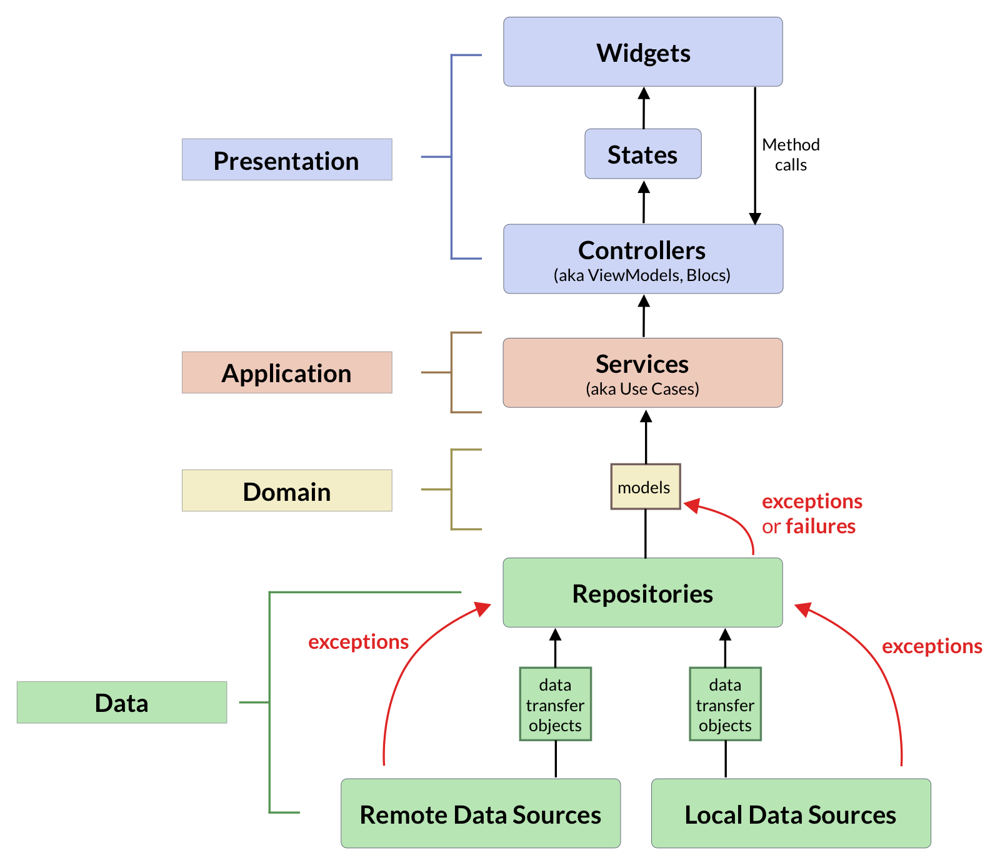

# REPOSITORY PATTERN

## What

The repository pattern be used to access data objects from various sources, such as a backend API, local database, etc, and make them available as type-safe entities to the domain layer of the app (which is where our business logic lives).

following architecture diagram:

In this context, repositories are found in the data layer. And their job is to:
- isolate domain models (or entities) from the implementation details of the data sources in the data layer.
- convert data transfer objects to validated entities that are understood by the domain layer
- (optionally) perform operations such as data caching.

Note: If your widgets work directly with key-value pairs from a REST API or a remote database, you're doing it wrong. In other words: do not mix business logic with your UI code. This will make your code much harder to test, debug, and reason about. - Andrea

## When

The repository pattern is very handy if your app has a complex data layer with many different endpoints that return unstructured data (such as JSON) that you want to isolate from the rest of the app.

A few use cases where the repository pattern is most appropriate:
- Unit test
- talking to REST APIs
- talking to local or remote databases
- talking to device-specific APIs (e.g. permissions, camera, location, etc.)

One great benefit of this approach is that if there are breaking changes in any 3rd party APIs, only have to update your repository code.

## Some Experience

### Repositories may not need an abstract class

In general, creating an abstract class makes sense if you need many implementations that conform to the same interface.

When working with repositories, we'll likely need only one implementation for a given repository.

### Repositories scale horizontally

As an application grows, we may find adding more and more methods to a given repository. This is likely to happen if our backend has a large API surface, or if our app connects to many different data sources.

In this scenario, consider creating multiple repositories, keeping related methods together. For example, if building an eCommerce app, we could have separate repositories for product listings, shopping cart, orders management, authentication, checkout, etc.

### Keep it Simple

As usual, keeping things simple is always a good idea. So don't get too wound up overthinking our APIs.

We can model your repository's interface after the API that we need to use, and call it a day. we can always refactor later if needed.

why repo ? H2. Need to clarify

ref link